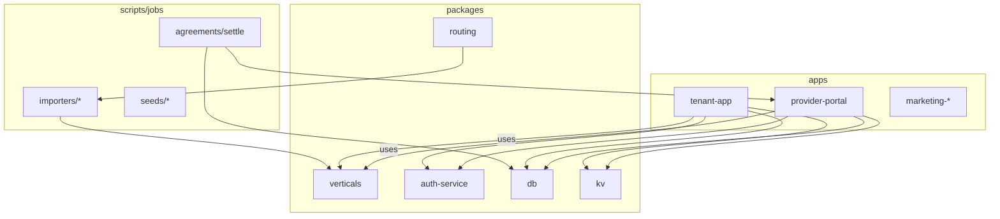
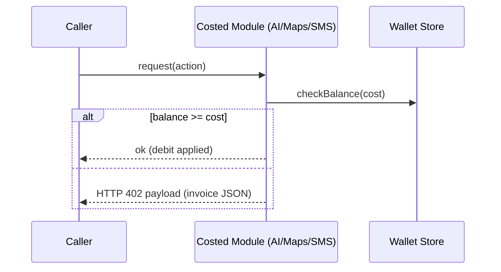
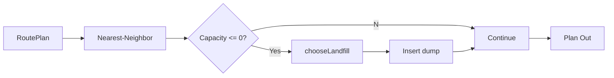

# Cortiware Architecture (Phase-2+)

This document captures the system architecture and key flows for remaining phases. Cross-refs: ../planning/ROADMAP.md, ./DEPENDENCIES.md, ./DATA_MODELS.md.

## Monorepo Topology (Mermaid)


## Costed Action Guard (Wallet or 402)


## Routing Planner (Phase-2 Enhancements)
- Inputs: yard, capacity, stops, landfill catalog (accepts)
- Extensions: configurable detour heuristic; preferred landfill override; exchange semantics
- Outputs: ordered stops with auto-dump insertion



## Agreements Settlement Pipeline
```mermaid
flowchart TB
  Evt[Agreement Events]-->Eval[Rules Eval]
  Eval-->Charges[Charges JSON]
  Charges-->Settle[Wallet-first Settle]
  Settle-->Debit[(Wallet Txn)]
  Settle--402-->Invoice[Invoice Payload JSON]
  Invoice-->Billing[Existing Billing Endpoint (no new routes)]
```

## Data Ownership & Isolation
- Multi-tenant isolation (RLS) enforced in DB (see DATA_MODELS.md)
- Scripts run org-scoped; no cross-tenant leakage

## Contracts & Route Cap
- Contract snapshots remain stable; route count checks enforced by CI
- All new capabilities wired via packages/* and scripts/*, not new routes

