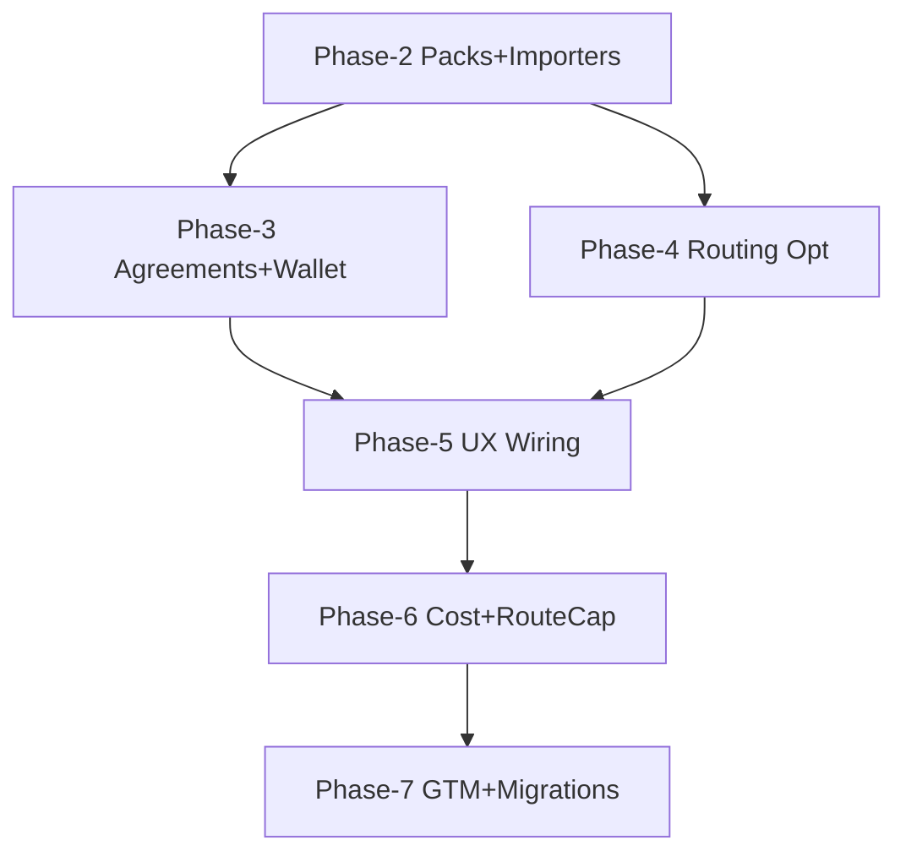

# Dependency Graph & Critical Path

Cross-refs: ./ROADMAP.md, ./ARCHITECTURE.md

## Mermaid Dependency Graph

## Critical Path
1. Phase-2: finalize stable data shapes for packs/importers
2. Phase-3: implement agreements eval + wallet settlement (relies on stable shapes)
3. Phase-4: routing optimization (independent but benefits from Phase-2 catalogs)
4. Phase-5: UX wiring consuming outputs from Phases 2-4
5. Phase-6: cost guards + route cap verification across the whole system
6. Phase-7: migration templates after models stabilize

## Blockers & Decision Points
- DB model alignment for wallet and agreements (DATA_MODELS.md)
- Perf thresholds for routing (TEST_PLANS.md)
- CI time budgets and caching strategy

